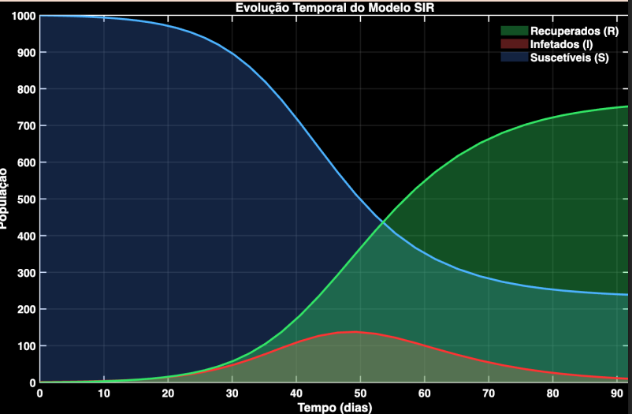

# SIR-MODEL-NUMERIC
<div style="display: flex; justify-content: center; margin:1.2em;">
  
</div>


Este projeto foi realizado no contexto da cadeira de **Simulação Numérica em Engenharia** durante o **Mestrado em Computação Avançada** na **Universidade do Minho**.

## Grupo

  - Diogo Coelho da Silva
  - Tomás Alexandre Torres Pereira

## Modelo SIR
O modelo SIR é um modelo epidemológico utilizado para descrever como a infeção se propaga ao longo de uma epidemia. A palavra SIR é uma referência aos três estados possíveis que o nosso modelo comporta.

  - **S** - Os individuos que se encontram neste estado estão suscetiveis a ser infetados.

  - **I** - Os individuos que se encontram neste estado estão infetados.

  - **R** - Os individuos que se encontram neste estado estão recuperados. No caso de uma epidemia este grupo de individuos representa individuos que ficaram imunes á doença, ou que faleceram.

### Assumpções do Modelo
  O modelo SIR funciona admitindo os seguintes axiomas:

  - O modelo trabalha sobre uma população fechada de tamanho **N**. Isto significa que a qualquer momento no modelo a seguinte equação se verifica:


$$
N = { S(t) + I(t) + R(t)}
$$

  - Admite-se que um individuo afetado passa a ser infecioso com efeito imediato.
  - Todos os individuos da população tem a mesma probabilidade de ser infetado por outros individuos.
  - Inicialmente todos os individuos estão na classe susceptivel exceto o individuo zero. 

### Transição entre Estados e Sistema de Equações

O modelo epidemológico (SIR), contém três parâmetros iniciais que configurarm a maneira como o modelo se comporta.

 - ${\beta}$ - O valor de alfa corresponde à taxa de infeção por pessoa por semana

 - ${\gamma}$ - O valor de gamma corresponde à taxa de recuperados por dia.

- ${N}$ - Número de individuos na população


A imagem a seguir representa a transição entre estados do modelo epidemológico.

<div style="display: flex; justify-content: center; margin:1.2em;">
  
</div>


O modelo SIR é descrito pelas seguintes equações:

<p align="center">
  
</p>


Os parâmetros iniciais tomaram os seguintes valores:

- ${\beta}$ = 0.002 (p/pessoa e semana)
- ${\gamma}$ = 0.15 (p/dia)
- ${N}$ = 1001 individuos (1 infetado e 1000 susceptiveis)
 

## Resultados Numéricos

O código para a execução do código encontra-se em [Epidemia](./src/epidemia.mlx).

Através do uso do método de range kutta de 4/5 ordem adaptativo conseguimos atingir as soluções do problema.
A seguinte função foi usada:

```matlab

options = odeset('Events', @myEvent);

[t, dState] = ode45(@epidemia, deltaT, SIR_STATE, options)

[t, dState]

function [value, isterminal, direction] = myEvent(deltaT, SIR_STATE)
    value      = ~((SIR_STATE(2) - 10) < 0);
    isterminal = 1;   
    direction  = -1;
end

function dState = epidemia(deltaT, SIR_STATE)
    
    % Parametros iniciais
    a = 0.002 / 7; % Taxa de infeção por dia
    r = 0.15; % Taxa de recuperação por dia

    S = SIR_STATE(1);
    I = SIR_STATE(2);
    R = SIR_STATE(3);

    % O número de recuperados não depende dos próprios recuperados
    % Apenas depende da taxa de infeção dos infetados.
    dS = -a*S*I; 
    dI = a*S*I - r*I; 
    dR = r*I; 
    dState = [dS; dI; dR];
 
end
```

O número de individuos infetados acabou por ser menor que 10 ao fim de **90 dias**. A evolução da epidemia até o número de infetados ser menor que 10 pode ser descrito pelo seguinte gráfico.



